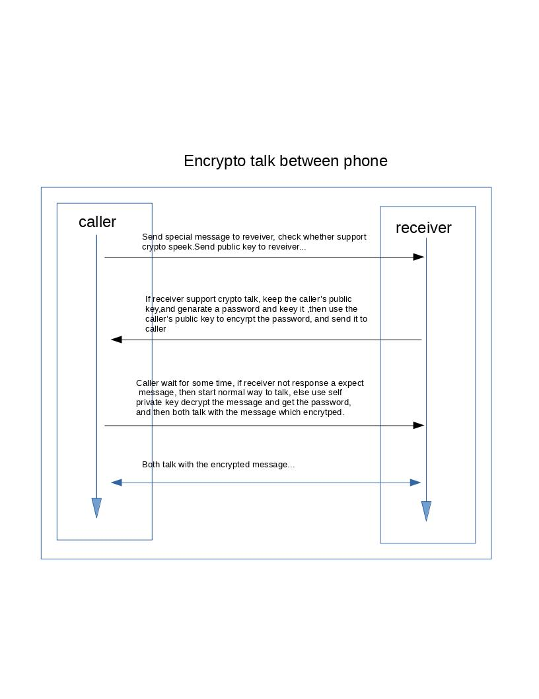
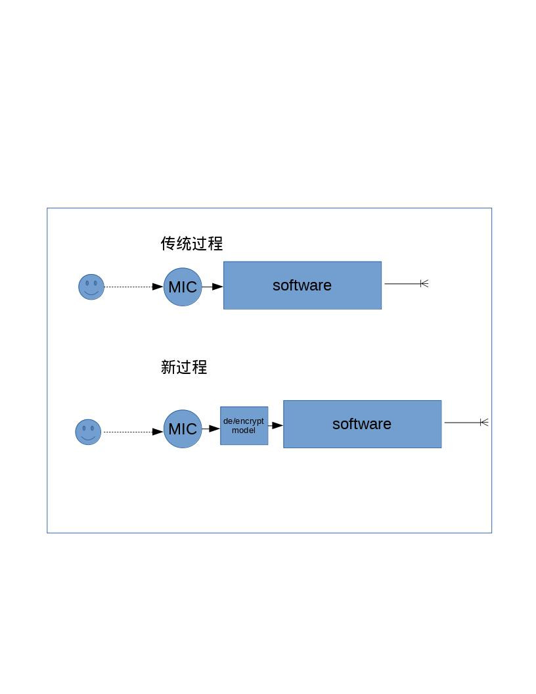

# 手机安全通信软件
## 想避免手机通话被监听，我们可以这样做

下面时绘制的原理图：

 

整个过此是依赖当前的非对称加密算法实现。
我们假设有两个角色Caller和Receiver：
1. Caller主动向Recevier发起呼叫
2. 通话接通后，Caller加密一段数据，发送自己的public key给Reveicer。
3. 如果Reveicer端能够识别该段信息，则生成一段定长的字符串C用作以后的对称加密密码，并使用Caller的public key加密后发送给Caller
4. Caller收到Receiver返回的信息后，进行解密得到密码C。
5. 以后的通话都先使用密码C使用AES进行加密后，发送到Receiver端。
6. Receiver端同样的操作，直至通信完成
7. 在第2步完成时，如果Receiver端不能识别Caller发送的信息，在等待一定的超时时间后，进行普通通话

### 同样的也可以这样，先进行正常通话，然后打开加密通话的功能（实现该功能按照上面描述的步骤进行），这样就可以随开随关的进行加密通话了。

## 关于加密短信过程如下：
1. 发送端A 编辑了一段消息，使用密码C进行了加密，将密码 信息的hash值，接收人标识保存，然后将加密后的消息发送给接收端B
2. 接收端B 如果想要读取该消息，则向发送端A发送自己的public key和消息的hash值。
3. 发送端A 收到接收端B的请求后，验证通过后，将密码C使用B的public key加密后发送给接收端B。
4. 接收端B 使用自己的private key解密得到密码C，然后对短信进行解密。

这里可以按照这样的原则开发一个APP，然后进行加密通话。go go go go！！

如果对我的想法感兴趣，请联系作者。